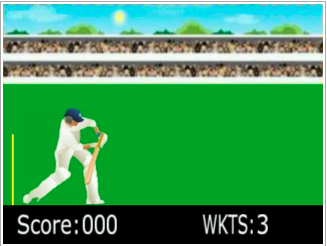
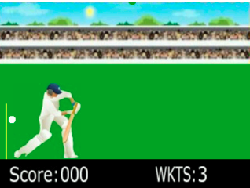

# CricketGame

A Game inspired by the miniclip game , Hit the Wicket.The user controls the batsman's movement on the screen and needs to defend the wicket from the ball that comes at different trajectories. The game ends when the user misses the ball and it hits the wickets thrice.

### Description of How the Game Works:

- After the code is running, the start page of the game is displayed. To start playing the game, the spacebar on the keyboard needs to be pressed and this is indicated on the start page as well.
  After the spacebar on the keyboard is pressed the game will start.
- The game starts with score 0 and 3 wickets (acts as lives in a video game).
- The purpose of this cricket game is to defend the wicket from the balls, and make the highest score possible by hitting the balls. You do this by hitting the ball when it comes towards and in close range to the bat.
  There are 2 shots to hit the ball, a straight shot and a loft shot.
- The straight shot is activated when ‘D’ is pressed on the keyboard and this awards the player a score of 1 (indicating a 1 run in cricket). The loft shot is activated when ‘A’ is pressed on the keyboard and awards the player a score of 4 or 6 (indicating 4 or 6 runs made in cricket by hitting a boundary.)
  If ‘D’ or ‘A’ is not pressed when the ball is in close range to the bat, this means the batsman has missed the ball and as a result the ball will hit the wicket.
  When the ball hits the wicket, the player loses 1 wicket.
- Player has a total of 3 wickets before they lose the game.
  Once the player has lost the 3 wickets and hence lost the game, the player is taken to the end page.
- The game can be started over by pressing the spacebar on the keyboard and this is indicated on the end page as well.
  After the spacebar on the keyboard is pressed the game starts again with 0 score and 3 wickets.
  

